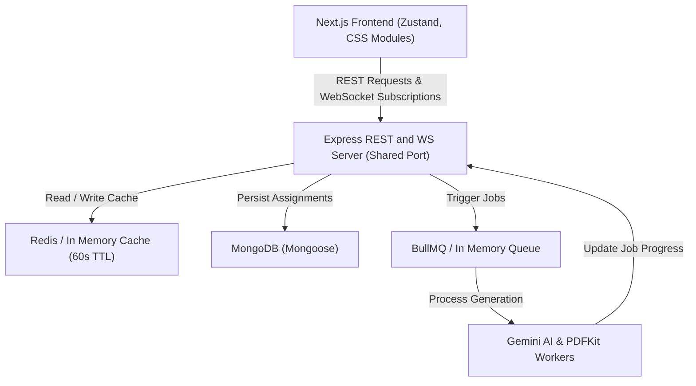

# System Architecture and API Documentation

QRaft is structured as a decoupled full stack application consisting of a React based Next.js frontend and a TypeScript Node/Express backend. Realtime updates, background scheduling, caching, and document rendering are handled via specialized modular services.

## Architecture Overview

The system flow and component interactions are visualized in the Mermaid diagram below:



### Architecture Core Principles
1. **Strict Schema Enforcement**: We configure Gemini 2.5 Flash using the structured JSON response schemas supported natively by the Google Gen AI SDK. This guarantees that the AI output matches our interface models.
2. **State Synchronization**: Zustand stores state changes locally. When a creation or regeneration request is submitted, the frontend opens a lightweight WebSocket connection to subscribe to realtime progress updates.
3. **Job Separation**: Creating an assignment does not block the HTTP thread. It writes a `pending` assignment to MongoDB, queues the job via BullMQ (or the in memory scheduler), and returns a `201 Created` status immediately.
4. **On The Fly PDF Compilation**: Instead of storing bloated, static PDF files on disk, PDFs are compiled on the fly using PDFKit when the user clicks "Download". This ensures the PDF always reflects the latest state of the database and keeps disk usage extremely lean.

## Database Schema

### `User` Schema
This represents the user entity stored inside MongoDB for JWT authentication and multi-user configuration:

```typescript
const UserSchema = new Schema({
  name: { type: String, required: true },
  email: { type: String, required: true, unique: true, lowercase: true, trim: true },
  password: { type: String, required: true },
  schoolName: { type: String, required: true },
  schoolAddress: { type: String, default: '' },
  schoolLogo: { type: String, default: '...' },
  userAvatar: { type: String, default: '...' }
}, { timestamps: true });
```

### `Assignment` Schema
This represents the root assignment entity stored inside MongoDB. Each assignment is associated with a specific user for secure multi-tenant access:

```typescript
const QuestionTypeConfigSchema = new Schema({
  type: { type: String, required: true },
  count: { type: Number, required: true },
  marks: { type: Number, required: true }
});

const QuestionSchema = new Schema({
  text: { type: String, required: true },
  difficulty: { type: String, enum: ['Easy', 'Moderate', 'Hard'], required: true },
  marks: { type: Number, required: true }
});

const SectionSchema = new Schema({
  name: { type: String, required: true },
  title: { type: String, required: true },
  instruction: { type: String, required: true },
  questions: [QuestionSchema]
});

const AssessmentResultSchema = new Schema({
  schoolName: { type: String, required: true },
  subject: { type: String, required: true },
  class: { type: String, required: true },
  timeAllowed: { type: String, required: true },
  maxMarks: { type: Number, required: true },
  sections: [SectionSchema]
});

const AssignmentSchema = new Schema({
  user: { type: Schema.Types.ObjectId, ref: 'User', required: true },
  title: { type: String, required: true },
  schoolName: { type: String, required: true },
  subject: { type: String, required: true },
  gradeClass: { type: String, required: true },
  dueDate: { type: Date, required: true },
  questionsConfig: [QuestionTypeConfigSchema],
  additionalInstructions: { type: String },
  status: { type: String, enum: ['pending', 'processing', 'completed', 'failed'], default: 'pending' },
  lifecycleStatus: { type: String, enum: ['ongoing', 'due', 'completed'], default: 'ongoing' },
  progress: { type: Number, default: 0 },
  result: AssessmentResultSchema,
  pdfUrl: { type: String },
  errorMsg: { type: String }
}, { timestamps: true });
```

## WebSocket Protocol

To enable live progress tracking during generation, the frontend establishes a WebSocket connection on the shared HTTP server and subscribes to the assignment ID:

### 1. Client Subscription Packet
```json
{
  "type": "subscribe",
  "assignmentId": "60d5ec49f390ef1488c9cf01"
}
```

### 2. Server Subscription Confirmation
```json
{
  "type": "subscribed",
  "assignmentId": "60d5ec49f390ef1488c9cf01",
  "message": "Successfully subscribed to updates for assignment 60d5ec49f390ef1488c9cf01"
}
```

### 3. Server Progress Milestones (Pushed at each stage)
* **10%**: Pipeline initialized.
* **30%**: Google Gemini AI model invoked.
* **60%**: Structured JSON parsed and validated.
* **85%**: PDF layout mapped and compiled.
* **100%**: DB updated, PDF cached. Status set to `completed` or `failed`.

```json
{
  "type": "progress",
  "assignmentId": "60d5ec49f390ef1488c9cf01",
  "progress": 60,
  "status": "processing",
  "result": null,
  "errorMsg": null,
  "pdfUrl": null
}
```

## REST API Endpoints

All endpoints except System Health and Authentication require a valid JWT token sent in the `Authorization` header:
`Authorization: Bearer <your_jwt_token>`

### 1. System Health
* **Method**: `GET`
* **URL**: `/api/health`
* **Response**: `200 OK`
    ```json
    {
      "status": "ok",
      "service": "QRaft AI Assessment Creator API"
    }
    ```

### 2. User Registration
* **Method**: `POST`
* **URL**: `/api/auth/register`
* **Headers**: `Content-Type: application/json`
* **Body Schema**:
    ```json
    {
      "name": "John Doe",
      "email": "john.doe@school.edu",
      "password": "securepassword123",
      "schoolName": "Green Valley High School"
    }
    ```
* **Validation**: Password must be at least 6 characters. Email must be unique.
* **Response**: `201 Created`
    ```json
    {
      "token": "eyJhbGciOi...",
      "user": {
        "id": "60d5ec...",
        "name": "John Doe",
        "email": "john.doe@school.edu",
        "schoolName": "Green Valley High School",
        "schoolAddress": "",
        "schoolLogo": "...",
        "userAvatar": "..."
      }
    }
    ```

### 3. User Login
* **Method**: `POST`
* **URL**: `/api/auth/login`
* **Headers**: `Content-Type: application/json`
* **Body Schema**:
    ```json
    {
      "email": "john.doe@school.edu",
      "password": "securepassword123"
    }
    ```
* **Response**: `200 OK`
    ```json
    {
      "token": "eyJhbGciOi...",
      "user": { ... }
    }
    ```

### 4. Fetch Current User Details
* **Method**: `GET`
* **URL**: `/api/auth/me`
* **Headers**: `Authorization: Bearer <token>`
* **Response**: `200 OK` (User object without password)

### 5. Update User Profile
* **Method**: `PUT`
* **URL**: `/api/auth/update`
* **Headers**: `Authorization: Bearer <token>`
* **Body Schema**:
    ```json
    {
      "name": "John Doe Updated",
      "schoolName": "New School Academy",
      "schoolAddress": "123 Education Lane",
      "password": "newpassword123"
    }
    ```
* **Validation**: Password must be at least 6 characters if changed.
* **Response**: `200 OK` (Updated user object)

### 6. Fetch All Assignments (User-Specific)
* **Method**: `GET`
* **URL**: `/api/assignments`
* **Headers**: `Authorization: Bearer <token>`
* **Caching**: Cached for 60 seconds.
* **Logic**: Returns only the assignments belonging to the authenticated user. Automatically scans and updates assignments whose due dates have passed from `ongoing` to `due`.
* **Response**: `200 OK` (Array of Assignment objects)

### 7. Create New Assignment
* **Method**: `POST`
* **URL**: `/api/assignments`
* **Headers**: `Content-Type: application/json`, `Authorization: Bearer <token>`
* **Body Schema**:
    ```json
    {
      "title": "Weekly Biology Test",
      "schoolName": "Green Valley High School",
      "subject": "Biology",
      "gradeClass": "9th Grade",
      "dueDate": "2026-06-15",
      "timeAllowed": "1 hour 30 minutes",
      "additionalInstructions": "Cover Photosynthesis and Plant Cells",
      "questionsConfig": [
        { "type": "Multiple Choice Questions", "count": 10, "marks": 1 },
        { "type": "Short Questions", "count": 5, "marks": 3 }
      ]
    }
    ```
* **Response**: `201 Created` (The saved `pending` assignment object with `user` ID populated)

### 8. Fetch Assignment Details
* **Method**: `GET`
* **URL**: `/api/assignments/:id`
* **Headers**: `Authorization: Bearer <token>`
* **Access Control**: Validates that the requested assignment belongs to the authenticated user.
* **Caching**: Cached individually for 60 seconds.
* **Response**: `200 OK` (Single Assignment object)

### 9. Regenerate Assignment
* **Method**: `POST`
* **URL**: `/api/assignments/:id/regenerate`
* **Headers**: `Authorization: Bearer <token>`
* **Access Control**: Validates that the assignment belongs to the authenticated user.
* **Logic**: Resets status to `pending`, clears older results, and re-queues the background generation job.
* **Response**: `200 OK` (Reset Assignment object)

### 10. Delete Assignment
* **Method**: `DELETE`
* **URL**: `/api/assignments/:id`
* **Headers**: `Authorization: Bearer <token>`
* **Access Control**: Validates that the assignment belongs to the authenticated user.
* **Response**: `200 OK`
    ```json
    {
      "success": true,
      "message": "Assignment successfully deleted."
    }
    ```

### 11. Update Lifecycle Status
* **Method**: `PATCH`
* **URL**: `/api/assignments/:id/status`
* **Headers**: `Authorization: Bearer <token>`
* **Access Control**: Validates that the assignment belongs to the authenticated user.
* **Body**:
    ```json
    {
      "status": "completed"
    }
    ```
* **Response**: `200 OK` (Updated Assignment object)

### 12. Download PDF
* **Method**: `GET`
* **URL**: `/api/assignments/:id/download`
* **Headers**: `Authorization: Bearer <token>`
* **Query Parameter Fallback**: Supports `?token=<token>` for browser download links.
* **Access Control**: Validates that the assignment belongs to the user matching the token.
* **Headers Sent**:
    * `Content-Type: application/pdf`
    * `Content-Disposition: attachment; filename="weekly_biology_test_question_paper.pdf"`
* **Logic**: Compiles the assignment data into a beautiful, double bordered A4 document on the fly and streams the vector stream directly to the client.
